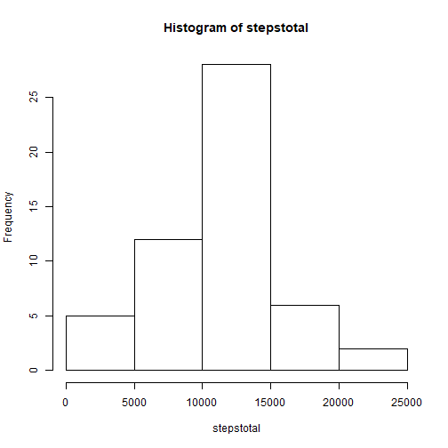
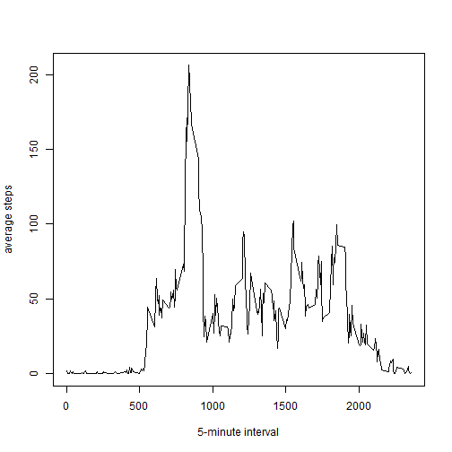
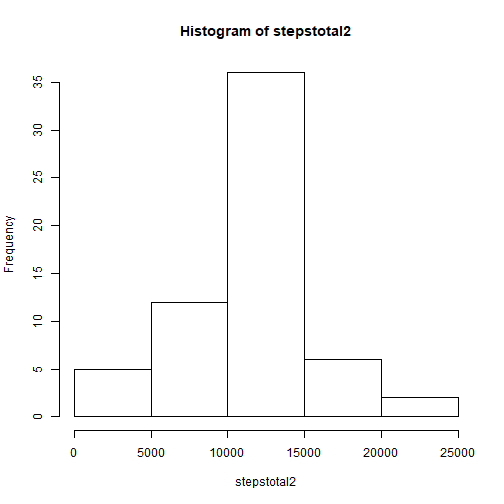
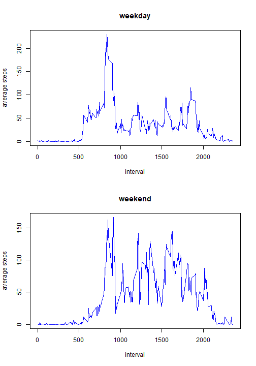

# Activity monitoring
rucrbser

## Setting directory


```r
setwd("C:/users/x/desktop/PA1_template")
```


## Setting global option


```r
library(knitr)
opts_chunk$set(echo = TRUE)
```


## Loading and preprocessing the data


```r
activity <- read.csv("activity.csv")
```


## What is mean total number of steps taken per day?


```r
stepstotal <- with(activity, tapply(steps, date, sum))
stepstotal <- stepstotal[!is.na(stepstotal)]

hist(stepstotal)
```



```r
stepsmean <- as.character(round(mean(stepstotal), digits = 2))
stepsmedian <- median(stepstotal)
```

The mean and median of the total number of steps 
taken per day is 10766.19 and 10765.


## What is the average daily activity pattern?


```r
activity <- transform(activity, interval = factor(interval))
stepsaverage <- with(activity, tapply(steps, interval, mean, na.rm = TRUE))
with(activity, plot(levels(interval), stepsaverage, type = "l",
                    xlab = "5-minute interval", ylab = "average steps"))
```



```r
intervalmax <- levels(activity$interval)[which.max(stepsaverage)]
```

The 835 5-minute interval contains the maximum number of steps 
on average across all the days in the dataset.


## Imputing missing values


```r
bad <- !(complete.cases(activity))
NAnum <- sum(bad)

library(dplyr)
```

```
## 
## Attaching package: 'dplyr'
```

```
## The following objects are masked from 'package:stats':
## 
##     filter, lag
```

```
## The following objects are masked from 'package:base':
## 
##     intersect, setdiff, setequal, union
```

```r
activity2 <- as.data.frame(group_by(activity, interval))
activity2[bad, ]$steps <- stepsaverage

stepstotal2 <- with(activity2, tapply(steps, date, sum))
hist(stepstotal2)
```



```r
stepsmean2 <- as.character(round(mean(stepstotal2), digits = 2))
stepsmedian2 <- as.character(round(median(stepstotal2), digits = 2))
```

The total number of missing values in the dataset is 2304.

The mean and median of the total number of steps taken per day is 10766.19 and 10766.19. They are much close to the estimates from the first part of the assignment. There is no much impact imputing missing data on the estimates of the total daily number of steps with the mean/median for that day or the mean for that 5-minute interval.


## Are there differences in activity patterns between weekdays and weekends?


```r
Sys.setlocale("LC_ALL", "English")
```

```
## [1] "LC_COLLATE=English_United States.1252;LC_CTYPE=English_United States.1252;LC_MONETARY=English_United States.1252;LC_NUMERIC=C;LC_TIME=English_United States.1252"
```

```r
activity2 <- mutate(activity2, day = weekdays(as.Date(activity2$date)))
```

```
## Warning: package 'bindrcpp' was built under R version 3.4.4
```

```r
activity2$day[!((activity2$day %in% 'Saturday')|
                      (activity2$day %in% 'Sunday'))] = "weekday"
activity2$day[(activity2$day %in% 'Saturday')|
                      (activity2$day %in% 'Sunday')] = "weekend"
activity2 <- transform(activity2, day = factor(day))

library(lattice)
stepsaveweekday <- with(activity2[activity2$day == "weekday", ], 
                        tapply(steps, interval, mean))
stepsaveweekend <- with(activity2[activity2$day == "weekend", ], 
                        tapply(steps, interval, mean))
par(mfrow = c(2,1))
with(activity2, plot(levels(interval), stepsaveweekday, type = "l", col = "blue",
                     xlab = "interval", ylab = "average steps", main = "weekday"))
with(activity2, plot(levels(interval), stepsaveweekend, type = "l", col = "blue",
                     xlab = "interval", ylab = "average steps", main = "weekend"))
```



